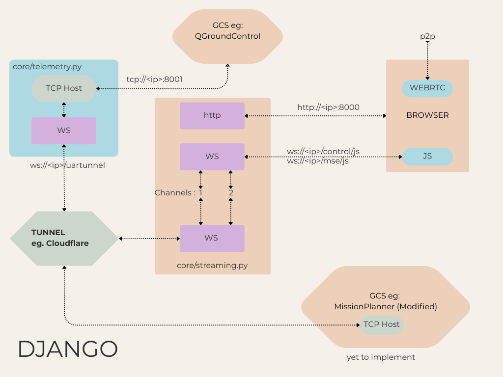
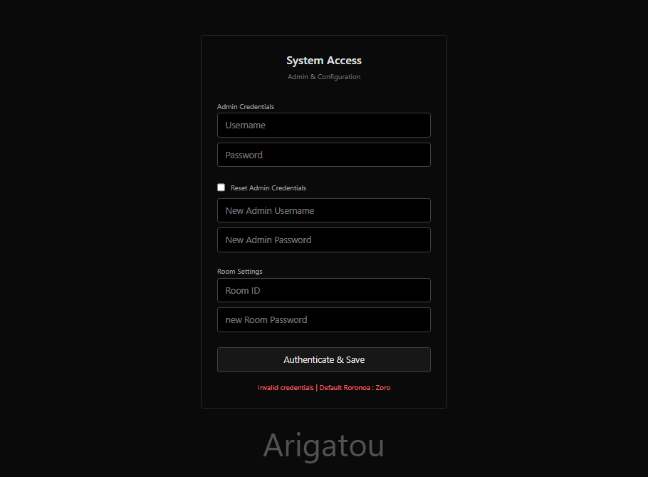
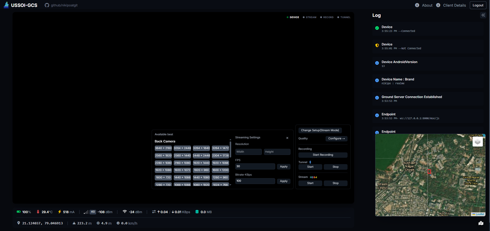
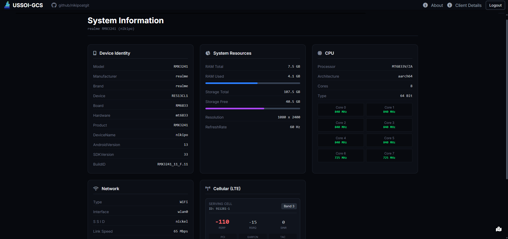
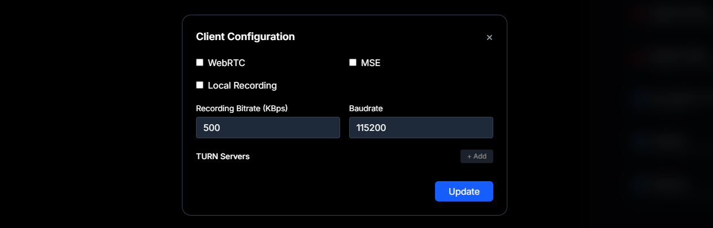

# GS (ground-Server) for USSOI
> **⚠️ Important Note:**
> *  See https://github.com/nikipoatgit/USSOI-CAM for Android Client  
> *  See https://github.com/nikipoatgit/GS_For_USSOI for Host Implementation
> *  See https://github.com/nikipoatgit/FlightController_H743 if want make ur own FC

#### Future Updates :
* Multi client support  

## 📑 Table of Contents
- [Documentation](https://github.com/nikipoatgit/GS_For_USSOI/wiki)
- [System Architecture](#system-architecture)
- [Tunnel Setup Example](#tunnel-setup-example)
- [Getting Started](#getting-started)
  - [Login](#1-login)
  - [Control Panel](#2-control-panel)
  - [SERIAL Tunnel](#3-serial-tunnel)

##  System Architecture


## Tunnel Setup Example 
- This is tutorial video:  https://youtu.be/BnWfbv7Fy-k?si=R0Wx2TWKwuTyaIH1 by 
`Piyush Garg` to setup Basic tunnel with cloudflare if you own a domain then watch from `11:25 min`.

## Getting Started

The application supports two execution modes:

### Standalone executable

- Download the latest prebuilt executable from the project's Releases (this will redirect to the latest release tag): https://github.com/nikipoatgit/GS_For_USSOI/releases/latest

- Alternatively, run the copy bundled in the `executable/` directory. On first run the application will create `gs_config.json` and `db.sqlite3` in the directory where the executable is launched (usually `executable/`).


### Manual Django server

Start the ASGI server from the project root:

<div style="margin-left:5%">

```bash
daphne -b 127.0.0.1 -p 8000 server_manager.asgi:application
```

Or use the runner script:

```bash
python run_gs.py
```

Note: configuration and database files are created in the current working directory.

#### Configuration hints

To enable domain-based access and secure cookies, adjust these settings (in `gs_config.json` or your deployment settings):

```json
{
  "session_cookie_secure": true,
  "csrf_cookie_secure": true,
  "csrf_trusted_origins": ["https://your-domain.com"],
  "secure_proxy_ssl_header": null,
  "use_x_forwarded_host": true
}
```

Replace `https://your-domain.com` with your actual domain and configure proxy headers as needed when behind a reverse proxy.

</div>

### 1. Login
Host-side logins are persistent until the user logs out.



### 2. Control Panel





### Serial Tunnel

Tunnel settings are configurable in `gs_config.json`. Example:

```json
  "TCP_host": "127.0.0.1",
  "TCP_port": 8001
```

Set `TCP_host` and `TCP_port` to match your network. To expose the tunnel on all interfaces use `"TCP_host": "0.0.0.0"`.




##### end of file