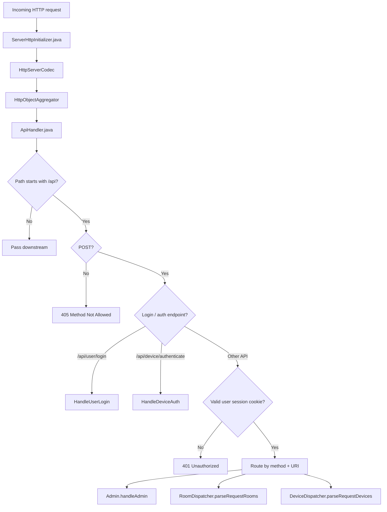
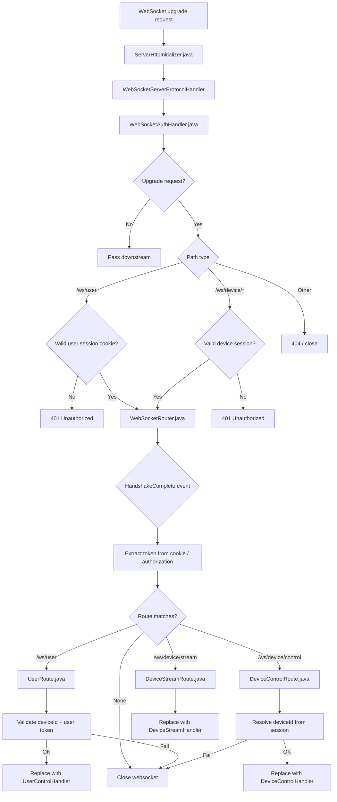
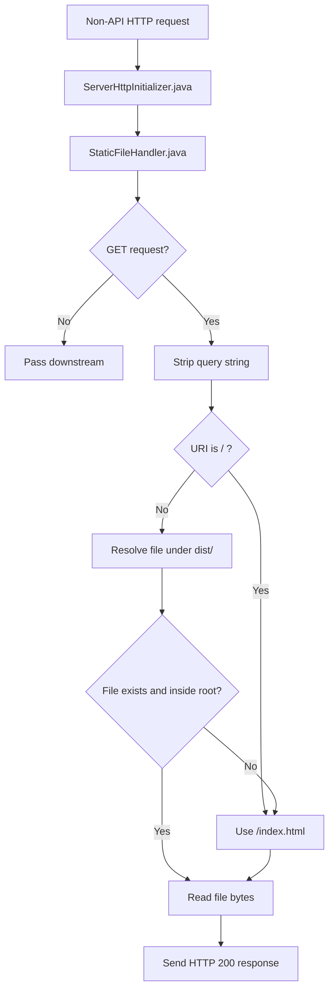

## API Table

| Method & Api | Type | Sub Type | Request | Response | Ack/Nack |
|---|---|---|---|---|---|
| Post(`/api/user/rooms`) | Room | Add | `{"type":"room","reqId":4516,"intent":"addRoom","roomId":"r1","roomName":"Test Room","roomPassword":"1234"}` | `{"reqId":4516,"status":"ack/nack","type":"Room","message":"..."}` | Ack/Nack |
| Post(`/api/user/rooms`) | Room | Remove | `{"type":"room","reqId":4516,"intent":"addRoom","roomId":"r1"}` | `{"reqId":4516,"status":"ack/nack","type":"Room","message":"..."}` | Ack/Nack |
| Post(`/api/user/rooms`) | Room | Get | `{"type":"room","reqId":1772304986270,"intent":"getRoom"}` | `[{"roomId":"83472","roomName":"arion"},{"roomId":"94731","roomName":"lecouch-2"}]` | |
| Post(`/api/user/devices`) | | getDevices | `{"reqId":1772307138238,"intent":"getDevices"}` | `[{"roomId":"r1","roomName":"Alpha","deviceId":"device-01"},{"roomId":"r2","roomName":"Beta","deviceId":"device-02"}]` | |
| Post(`/api/user/login`) | User | Login | `{"userId":"admin","userPass":"1234"}` | | |
| POST(`/api/device/authenticate`) | Device Auth | Login | `{"type":"login","deviceName":"dev1","deviceId":"generated_device_id","data":"BASE64_RSA_OAEP_ENCRYPTED"}` | `{"deviceToken":"generated_token","deviceId":"generated_device_id"}` | |
| POST(`/api/device/authenticate`) | Device Auth | Get Public Key | `{"type":"getKey"}` | `{"publicKey":"BASE64_RSA_PUBLIC_KEY","deviceId":"generated_device_id","challenge":"random_challenge","expiresAt":1710000000000}` | |
| post(`/api/admin`) | User | Get Users | `{"type":"user","cmd":"get"}` | `{"users":[{"id":101,"name":"nikhil","role":"admin","last_login":"12/01/2005 : 12:12","active":true}]}` | |
| post(`/api/admin`) | User | Add | `{"type":"user","cmd":"add","user_id":104,"username":"rahul","password":"*****","role":"operator"}` | `{"reqId":"-1","status":"ACK","type":"user","message":"user Added"}` | |
| post(`/api/admin`) | User | Delete | `{"type":"user","cmd":"delete","user_id":104}` | `{"reqId":"-1","status":"ACK","type":"user","message":"user deleted"}` | |
| post(`/api/admin`) | User | Ws | `{"type":"ws","cmd":"get"}` | `{"rooms":[{"room_id":"room1","room_name":"Room 1","devices":[{"device_id":"dev101","device_name":"Device 1","control":{"admins":[{"uid":"u101","uname":"nikhil"}],"operators":[{"uid":"u104","uname":"rahul"}],"viewers":[],"device":true},"stream":{"users":[{"uid":"u101","uname":"nikhil"},{"uid":"u104","uname":"rahul"}],"device":true},"data":[{"uid":"u5d5","uname":"base1"},{"uid":"u7a1","uname":"client2"}]},{"device_id":"dev102","device_name":"Device 2","device_connected":false,"control":{"admins":[],"operators":[],"viewers":[],"device":false},"stream":{"users":[],"device":false},"data":[]}]}]}` | |
| post(`/api/admin`) | Devices | Get | `{"type":"device","cmd":"get"}` | `{"devices":[{"did":"dev101","dname":"Device 1"},{"did":"dev102","dname":"Device 2"},{"did":"dev103","dname":"Device 3"}]}` | |


```mermaid
flowchart TD
    D[Device]-->S[Server]
    S-->U0[User]
    S-->U1[User3]
    S-->U2[User2]
    S-->U3[User3]
````
## JSON
#### Telemetry Device->server
```json
{"type":"t","d":"DEADBEEF0123456789}
```
Default every 3 sec 


```mermaid
flowchart TD
    U[user] -->|req| S[server]
    S -->|cache| R1[res (cache)]
    S -->|no cache| C{device Online? }
    C -->|yes| D[Device]
    D --> R2[res]
    C -->|no| E[err]
````

## JSON
#### get_params 
```json
{"type":"request","cmd":"get_params"}
{"type":"response","cmd":"get_params","status":"ok","data":{"Stream_mode":"NONE","params_set":false,"version":"2.0.1"}}
{"type":"error","cmd":"get_params","error":"device_offline"}
```
#### get_tunnels 
```json 
{"type":"request","cmd":"get_tunnels"}
{"type":"response","cmd":"get_tunnels","status":"ok","data":{"tunnels": ["bt-01", "usb-0"]}}
{"type":"error","cmd":"get_tunnels","error":"reason"}
```
#### get_res
```json 
{"type":"request","cmd":"get_res"}
{"type":"response","cmd":"get_res","status":"ok","data":{"res": "pending to do"}}
{"type":"error","cmd":"get_res","error":"reason"}
```
---
---

```mermaid
flowchart TD
    U[user] -->|req| S[server]
    S -->|authorized| C{device Online?}
    S -->|no authorized| E[err]
    C -->|yes| D[Device]
    D --> R2[res]
    D --> E[err]
    C -->|no| E[err]
````

## JSON

#### set_params
```json 
{"type":"request","cmd":"set_params","cmdId":"u1","param":{"Stream_mode":"NONE"}}
{"type":"response","cmd":"set_params","cmdId":"u1","status":"ok"}
{"type":"error","cmd":"set_params","cmdId":"u1","error":"Invalid Mode"}
```
Stream_mode : WEBRTC | H264 | HFH264 |NONE

#### start_stream
```json 
{"type":"request","cmd":"start_stream","cmdId":"u1"}
{"type":"response","cmd":"start_stream","cmdId":"u1","status":"ok"}
{"type":"error","cmd":"start_stream","cmdId":"u1","error":"Invalid"}
```

#### stop_stream
```json 
{"type":"request","cmd":"stop_stream","cmdId":"u1"}
{"type":"response","cmd":"stop_stream","cmdId":"u1","status":"ok"}
{"type":"error","cmd":"stop_stream","cmdId":"u1","error":"Invalid"}
```

#### start_recording
```json 
{"type":"request","cmd":"start_recording","cmdId":"u1"}
{"type":"response","cmd":"start_recording","cmdId":"u1","status":"ok"}
{"type":"error","cmd":"start_recording","cmdId":"u1","error":"Invalid"}
```

#### stop_recording
```json 
{"type":"request","cmd":"stop_recording","cmdId":"u1"}
{"type":"response","cmd":"stop_recording","cmdId":"u1","status":"ok"}
{"type":"error","cmd":"stop_recording","cmdId":"u1","error":"Invalid"}
```

#### set_stream_res
```json 
{"type":"request","cmd":"set_stream_res","cmdId":"u1","param":{"res":{"height":720,"width":1200,"fps":10},"bitrate":1000}}
{"type":"response","cmd":"set_stream_res","cmdId":"u1","status":"ok"}
{"type":"error","cmd":"set_stream_res","cmdId":"u1","error":"Invalid"}
```

#### set_record_res
```json 
{"type":"request","cmd":"set_record_res","cmdId":"u1","param":{"res":{"height":720,"width":1200,"Fps":10},"bitrate":10000}}
{"type":"response","cmd":"set_record_res","cmdId":"u1","status":"ok"}
{"type":"error","cmd":"set_record_res","cmdId":"u1","error":"Invalid"}
```

#### switch
```json 
{"type":"request","cmd":"switch","cmdId":"u1","param":{"camId":0}}
{"type":"response","cmd":"switch","cmdId":"u1","status":"ok"}
{"type":"error","cmd":"switch","cmdId":"u1","error":"Invalid"}
```

#### webrtc revice/send sdp 
```json 
{"type":"request","cmd":"webrtc_sdp","cmdId":"u1","param":{"sdp":{"type":"offer","sdp":"v=0..."}}}
{"type":"response","cmd":"webrtc_sdp","cmdId":"u1","data":{"sdp":{"type":"answer","sdp":"v=0..."}}}
{"type":"error","cmd":"webrtc_sdp","cmdId":"u1","error":"Invalid SDP"}
```

#### webrtc revice/send ice 
```json 
{"type":"request","cmd":"webrtc_ice","cmdId":"u2","param":{"candidate":{"candidate":"candidate:...","sdpMid":"0","sdpMLineIndex":0}}}
{"type":"response","cmd":"webrtc_ice","cmdId":"u2","data":{"candidate":{"candidate":"candidate:...","sdpMid":"0","sdpMLineIndex":0}}}
{"type":"error","cmd":"webrtc_ice","cmdId":"u1","error":"Invalid ICE"}
```

WebSocket APIs 

| WS API | Route class | Final handler | Requirements / notes |
|---|---|---|---|
| `/ws/user?deviceId=...` | [UserRoute.java](/home/nikipo/user/WEB/GCS_For_USSOI/server/app/src/main/java/ussoi/WebSocket/Route/User/UserRoute.java) | [UserControlHandler.java](/home/nikipo/user/WEB/GCS_For_USSOI/server/app/src/main/java/ussoi/WebSocket/Handler/User/UserControlHandler.java) | `Upgrade: websocket`, `Cookie`, valid user session, `deviceId` query param |
| `/ws/user/stream?deviceId=...` | [UserStreamRoute.java](/home/nikipo/user/WEB/GCS_For_USSOI/server/app/src/main/java/ussoi/WebSocket/Route/User/UserStreamRoute.java) | [UserStreamHandler.java](/home/nikipo/user/WEB/GCS_For_USSOI/server/app/src/main/java/ussoi/WebSocket/Handler/User/UserStreamHandler.java) | `Upgrade: websocket`, `Cookie`, valid user session, `deviceId` query param |
| `/ws/device/control...` | [DeviceControlRoute.java](/home/nikipo/user/WEB/GCS_For_USSOI/server/app/src/main/java/ussoi/WebSocket/Route/Device/DeviceControlRoute.java) | [DeviceControlHandler.java](/home/nikipo/user/WEB/GCS_For_USSOI/server/app/src/main/java/ussoi/WebSocket/Handler/Device/DeviceControlHandler.java) | `Upgrade: websocket`, `Cookie`, `Authorization`, valid device session |
| `/ws/device/stream...` | [DeviceStreamRoute.java](/home/nikipo/user/WEB/GCS_For_USSOI/server/app/src/main/java/ussoi/WebSocket/Route/Device/DeviceStreamRoute.java) | [DeviceStreamHandler.java](/home/nikipo/user/WEB/GCS_For_USSOI/server/app/src/main/java/ussoi/WebSocket/Handler/Device/DeviceStreamHandler.java) | `Upgrade: websocket`, `Cookie`, `Authorization`, valid device session |


**1. HTTP / API flow**


**2. WebSocket handshake + routing flow**


**3. Static file flow**

